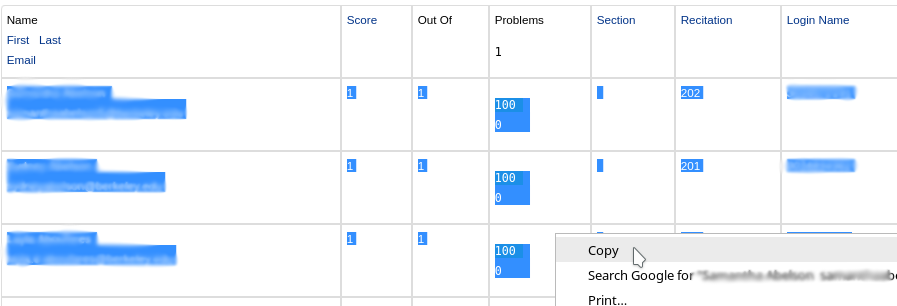
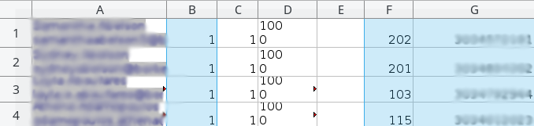

# Introduction

In fall 2019 Math10A with Prof. Stankova at Berkeley, GSIs need to input the scores of T/F homework questions as well as the midtem/final exams of their student into a gradesheet by hand. This program is designed to do the work semi-automatically.

# How to Use

## Prepare your gradesheet

Download `autograder.py`. Put your gradesheet in the same folder as `autograder.py` and rename it as `Gradesheet.xlsx` (case sensitive). If your gradesheet is in `xls` format, you should save it as a `xlsx` file and use the `xlsx` one. Also, make sure you write down your section number in cell Q1 (like "Section # 210") in both sheets of `Gradesheet.xlsx`.

## Prepare your data sheet

Suppose we want to upload the T/F questions scores for HW1, HW2, and HW3.

1. Create a empty `xlsx` named `HW1.xlsx`(case sensitive) in the same folder as `autograder.py`.

2. On bCourses -> WebWork -> student progress -> HW1, select all the data like below and copy them.

3. Select the cell A1 in `HW1.xlsx` and paste the data there, so that the scores are in column B, the section numbers are in column F, and the SIDs are in column G.

4. Do the same thing for HW2 and HW3.

## Run autograder

To run the code, you should have python package [openpyxl](https://pypi.org/project/openpyxl/) installed. If not, you can install it by

    pip install openpyxl

The code is done in Python 3, but it should also work well in Python 2.7 with some slight changes for grammar issues.

Now you have `autograder.py`, `Gradesheet.xlsx`, `HW1.xlsx`, `HW2.xlsx`, `HW3.xlsx` in the same folder. Run

    python autograder.py

and you will see something like

    ************** HW1 **************

    reading row: 
    575       

    Updating cells in Gradesheet...

    *** section 2XX ***

    updating 1234567890: 9 -> 10, 
    updating 1234567891: 6 -> 7, 
    updating 1234567892: 9 -> 9, 
    updating 1234567894: # WARNING: not in the gradesheet.

    HW1 Finished: 3 updated in total.

    *** section 2XY ***
    
    updating 2234567890: 0 -> 0,
    updating 2234567890: 9 -> 10,

    HW1 Finished: 2 updated in total.

The work is done.

# How does it work

The program will find the scores and SIDs of the stduents in your sections in `HW1.xlsx`, take the ceil integer of their socres, find the correct location according to the SID in `Gradesheet.xlsx` and add this integer score to the existed score there. So it is recommended to run the program after you have input the scores of the handwritten homework.

# For Midterms and Final

I also made some naive modification to make the code work for the midterms and finals. To use, you need to instead copy the data in GradeScope, paste it to `Mid1.xlsx`, and make sure all the emails are in column B and all the scores are in column C.

Also, you need to modify the following code in `autograder.py`. This should be easy if you know some basic regex replacement.

    # for exams only, modify this for your sections
    sec1_emails = ['modify this for your sections']  # a list of emails in your first section ("first" mean the first worksheet in the gradesheet), e.g. ['abc@berkeley.edu', 'def@berkeley.edu', ...]. You can get the email list on Calcentral, and then apply a regex replacement
    sec1_sids = ['modify this for your sections']  # a list of corresponding sid in your first section. sids and emails should match in order. Should be easy to get by a regex replacement "\n" -> ", "
    sec2_emails = ['modify this for your sections']  # a list of sid in your second section
    sec2_sids = ['modify this for your sections']  # a list of sid in your second section. sids and emails should match in order.
    section_No = ['modify this for your sections'] # first and second section number, e.g. [209, 210]

    exam = False    # use this when uploading hw grades
    # exam = True     # use this when uploading exam grades
